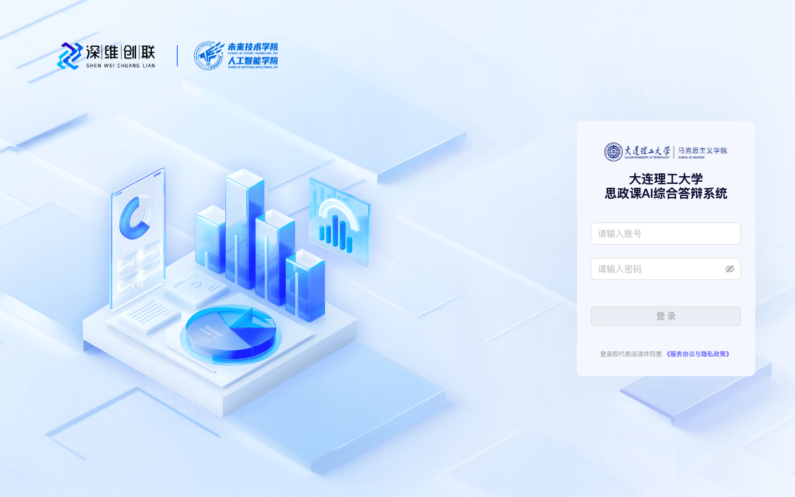
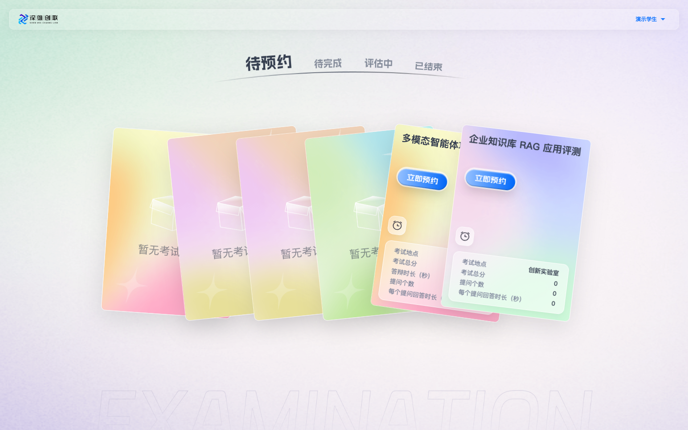
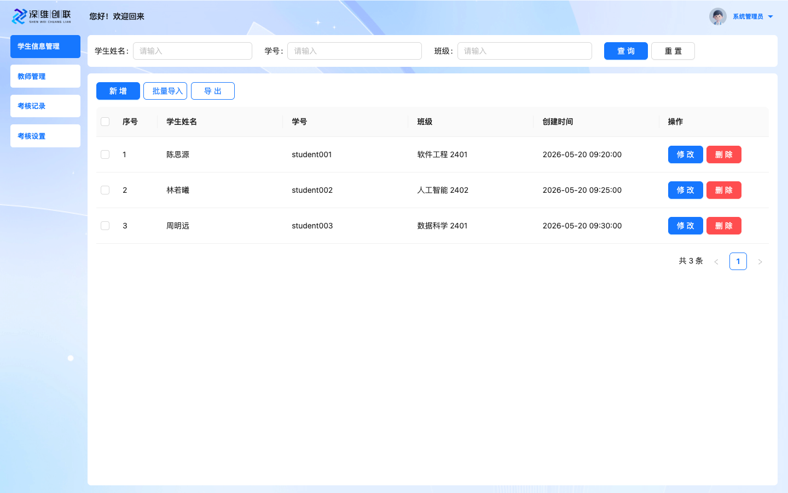
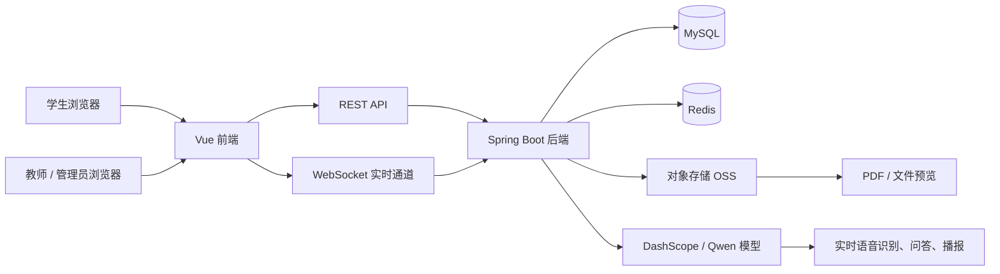
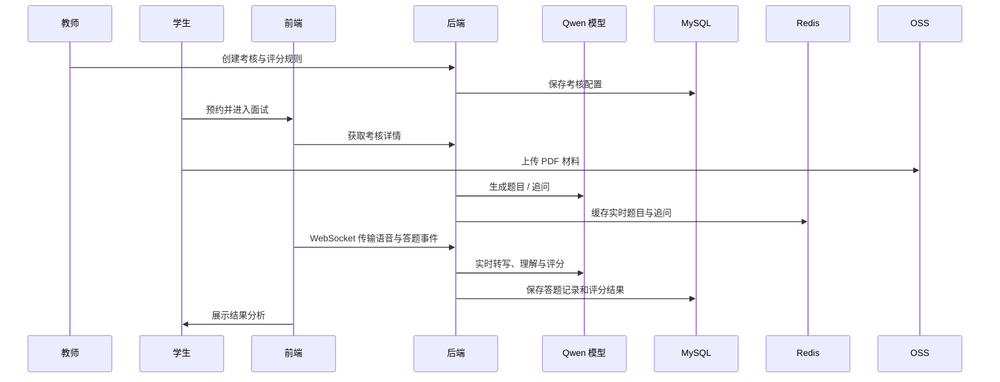

# AI Interview System

<p align="center">
  
  
  
  
  
  
</p>

<p align="center">
  <a href="#软件预览">软件预览</a> ·
  <a href="#核心能力">核心能力</a> ·
  <a href="#系统架构">系统架构</a> ·
  <a href="#本地运行">本地运行</a> ·
  <a href="#常见问题">常见问题</a>
</p>

面向高校课程答辩、项目验收和能力测评场景的 AI 面试系统。系统支持教师创建考核、学生在线预约与答辩、实时语音问答、追问生成、PDF 材料上传、自动评分与结果分析，帮助教学团队把分散的答辩流程沉淀为可追踪、可复盘、可量化的数字化工作流。

> 本项目为前后端分离架构，前端位于 `defense-system`，后端位于 `defense-assessment`。

## 软件预览

| 登录页 | 学生端考核列表 |
| --- | --- |
|  |  |

| 管理端学生信息管理 |
| --- |
|  |

## 核心能力

- **多角色工作台**：支持学生、教师、管理员三类角色，按角色动态加载工作台与权限路由。
- **考核配置管理**：教师可创建答辩主题、设置考核时长、题目数量、评分规则、预约安排和参与学生。
- **学生在线预约**：学生可查看待预约、待完成、评估中、已结束的考核任务。
- **实时语音面试**：通过 WebSocket 接入实时语音能力，支持学生语音输入、题目语音播报和实时答题状态同步。
- **AI 题目与追问**：系统根据考核设置、答辩材料和学生回答动态生成问题与追问。
- **PDF 材料上传与预览**：答辩材料通过对象存储保存，前端可在线预览。
- **自动评分与分析**：面试结束后生成总分、维度得分、答题明细、追问记录和改进建议。
- **过程缓存与恢复**：使用 Redis 缓存实时题目、追问和会话过程数据，降低重复生成和链路抖动影响。

## 技术栈

### 前端

- Vue 3
- Vue Router 4
- Pinia
- Ant Design Vue
- ECharts
- Tailwind CSS
- Axios
- PDF.js
- XGPlayer

### 后端

- Java 21
- Spring Boot 3.5
- Spring Web / WebSocket
- Sa-Token
- MyBatis-Plus
- HikariCP
- Redis / JetCache
- Aliyun OSS SDK
- OkHttp
- SpringDoc OpenAPI

### 基础设施

- **MySQL**：结构化业务数据，例如用户、考核设置、预约、答题记录和评分结果。
- **Redis**：实时面试过程缓存，例如当前题目、追问、临时会话状态和部分登录态。
- **对象存储 OSS**：保存 PDF、图片、音频等非结构化文件。
- **DashScope / Qwen**：提供文本生成、实时语音、多模态理解等 AI 能力。

## 系统架构



## 目录结构

```text
.
├── defense-assessment/        # Spring Boot 后端
│   ├── src/main/java/          # 业务代码、接口、服务、配置
│   └── src/main/resources/     # application 配置
├── defense-system/             # Vue 3 前端
│   ├── src/api/                # 前端 API 封装
│   ├── src/views/              # 页面
│   ├── src/components/         # 通用组件
│   └── src/router/             # 路由与权限
├── scripts/                    # 本地启动脚本
├── docs/images/                # README 截图资源
├── .env.example                # 本地环境变量模板
└── README.md
```

## 本地运行

### 环境要求

- Node.js 18+
- npm 9+
- Java 21
- MySQL 8+
- Redis 6+
- 可用的 DashScope API Key
- 可用的对象存储服务，例如 Aliyun OSS

### 1. 克隆项目

```bash
git clone <your-repository-url>
cd AI_Interview_system
```

### 2. 配置环境变量

复制环境变量模板：

```bash
cp .env.example .env.local
```

按需填写以下配置：

```bash
SPRING_PROFILE='local'
BACKEND_PORT='8081'
FRONTEND_PORT='3004'

DASHSCOPE_API_KEY='<your-dashscope-api-key>'
DASHSCOPE_REALTIME_MODEL='qwen3.5-omni-flash-realtime'
DASHSCOPE_REALTIME_VOICE='Ethan'

DB_JDBC_URL='jdbc:mysql://127.0.0.1:13307/defense_test?useUnicode=true&characterEncoding=UTF-8&useSSL=false&serverTimezone=GMT%2B8&allowMultiQueries=true'
DB_USERNAME='<your-db-user>'
DB_PASSWORD='<your-db-password>'

DB_TUNNEL_ENABLED='true'
DB_TUNNEL_WATCH='true'
DB_TUNNEL_CHECK_INTERVAL='5'
DB_TUNNEL_LOCAL_HOST='127.0.0.1'
DB_TUNNEL_LOCAL_PORT='13307'
DB_TUNNEL_REMOTE_HOST='127.0.0.1'
DB_TUNNEL_REMOTE_PORT='3306'
DB_TUNNEL_SSH_HOST='<your-server-host>'
DB_TUNNEL_SSH_USER='<your-server-user>'
DB_TUNNEL_SSH_PASSWORD='<your-server-password>'

JETCACHE_REDIS_URI='redis://127.0.0.1:6379/0'
REDIS_PASSWORD=''

ALIYUN_OSS_ENDPOINT='<your-oss-endpoint>'
ALIYUN_OSS_ACCESS_KEY_ID='<your-oss-access-key-id>'
ALIYUN_OSS_ACCESS_KEY_SECRET='<your-oss-access-key-secret>'
ALIYUN_OSS_BUCKET='<your-oss-bucket>'
```

> `.env.local` 包含 API Key、数据库密码、对象存储密钥等敏感信息，已经被 Git 忽略，请勿提交。

### 3. 准备数据库与 Redis

请准备一个 MySQL 数据库，例如：

```sql
CREATE DATABASE defense_test DEFAULT CHARACTER SET utf8mb4 COLLATE utf8mb4_unicode_ci;
```

当前仓库不内置生产数据。开源部署时建议自行维护数据库迁移脚本，例如 Flyway、Liquibase 或标准 SQL 初始化脚本。

Redis 默认连接：

```text
redis://127.0.0.1:6379/0
```

如需密码或远程 Redis，请同步修改 `spring.data.redis` 与 `JETCACHE_REDIS_URI` 相关配置。

### 4. 启动后端

```bash
./scripts/start-backend.sh
```

后端默认地址：

```text
http://localhost:8081
```

OpenAPI 文档地址：

```text
http://localhost:8081/swagger-ui.html
```

### 5. 启动前端

```bash
npm --prefix defense-system install
./scripts/start-frontend.sh
```

前端默认地址：

```text
http://localhost:3004
```

### 6. 一键重启

本地开发时可以使用：

```bash
./scripts/restart-local.sh
```

脚本会读取根目录 `.env.local`，并启动前端与后端服务。不要直接在 `defense-assessment` 目录里手动运行 `./mvnw spring-boot:run`，除非已经显式加载 `.env.local`；否则后端可能缺少 `DB_PASSWORD` 等环境变量，表现为端口可用但登录接口返回数据库连接失败。

## 配置说明

### AI 模型

后端通过 `dashscope.*` 配置接入模型服务：

| 配置项 | 说明 |
| --- | --- |
| `DASHSCOPE_API_KEY` | DashScope API Key |
| `DASHSCOPE_REALTIME_ENABLED` | 是否启用实时语音链路 |
| `DASHSCOPE_REALTIME_URL` | 实时模型 WebSocket 地址 |
| `DASHSCOPE_REALTIME_MODEL` | 实时语音模型，默认 `qwen3.5-omni-flash-realtime` |
| `DASHSCOPE_REALTIME_VOICE` | 题目播报音色 |
| `DASHSCOPE_ENABLE_THINKING` | 是否启用模型思考能力 |

### 数据库

本项目使用 MySQL 保存长期业务数据，后端通过 HikariCP 管理数据库连接池。

| 配置项 | 说明 |
| --- | --- |
| `DB_JDBC_URL` | MySQL JDBC 连接地址 |
| `DB_USERNAME` | 数据库用户名 |
| `DB_PASSWORD` | 数据库密码 |

本地开发如果需要通过 SSH Tunnel 访问远程 MySQL，可启用以下配置。当前本地开发推荐让 `DB_JDBC_URL` 指向 `127.0.0.1:13307`，由脚本负责把该端口转发到服务器 MySQL：

```bash
DB_TUNNEL_ENABLED='true'
DB_TUNNEL_WATCH='true'
DB_TUNNEL_CHECK_INTERVAL='5'
DB_TUNNEL_LOCAL_HOST='127.0.0.1'
DB_TUNNEL_LOCAL_PORT='13307'
DB_TUNNEL_REMOTE_HOST='127.0.0.1'
DB_TUNNEL_REMOTE_PORT='3306'
DB_TUNNEL_SSH_HOST='<your-server-host>'
DB_TUNNEL_SSH_USER='<your-server-user>'
DB_TUNNEL_SSH_PASSWORD='<your-server-password>'
```

生产部署不建议依赖本地 SSH Tunnel。推荐将后端部署到与 MySQL 相同的私有网络，使用内网地址连接数据库。

本地 `local` profile 会要求 `DB_USERNAME` 和 `DB_PASSWORD` 必须存在；如果缺失，后端应当启动失败，而不是等到登录页才抛数据库连接错误。

### Redis

Redis 用于缓存实时面试过程数据、模型生成结果和部分会话状态。相关代码主要位于：

- `StudentAssessmentService`
- `RedisConstants`
- `CacheConfig`

### 对象存储

系统通过 OSS 保存 PDF 材料和其他文件。数据库中通常只保存文件路径或 URL，实际文件由对象存储承载。

| 配置项 | 说明 |
| --- | --- |
| `ALIYUN_OSS_ENDPOINT` | OSS Endpoint |
| `ALIYUN_OSS_ACCESS_KEY_ID` | Access Key ID |
| `ALIYUN_OSS_ACCESS_KEY_SECRET` | Access Key Secret |
| `ALIYUN_OSS_BUCKET` | Bucket 名称 |

## 面试流程



## 常见问题

### 1. 登录后接口提示数据库连接失败

优先检查：

```bash
nc -vz -w 3 <mysql-host> <mysql-port>
```

如果本地通过 SSH Tunnel 连接远程 MySQL，请确认隧道进程存在、`DB_JDBC_URL` 指向本地转发端口，并且后端是在最新环境变量下启动。

### 2. Redis 连接失败

检查 Redis 是否启动：

```bash
redis-cli ping
```

期望返回：

```text
PONG
```

如果使用远程 Redis，请同步修改 `spring.data.redis.*` 和 `JETCACHE_REDIS_URI`。

### 3. PDF 无法上传或预览

检查 OSS 配置是否完整，并确认 Bucket 权限、跨域配置、预签名 URL 有效期与服务端时间一致。

### 4. 实时语音不可用

请确认：

- 浏览器允许麦克风权限。
- WebSocket 地址配置正确。
- DashScope API Key 有实时模型调用权限。
- 所选模型所在地域与 API Key 地域一致。

## 开发建议

- 不要提交 `.env.local`、数据库密码、API Key、OSS 密钥或 SSH 密码。
- 面试实时链路建议部署在稳定服务器环境，不要让正式学生流程依赖本地 SSH Tunnel。
- 开源部署建议补充数据库迁移脚本，保证新环境可一键初始化。
- 生产环境建议将前端静态资源部署到 CDN，并将后端、MySQL、Redis 放在同一私有网络或低延迟网络内。
- 日志中避免打印学生语音原文、密码、Token、API Key 等敏感信息。

## 许可证

本项目基于 MIT License 开源，详见 [LICENSE](LICENSE)。
